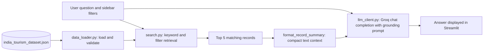
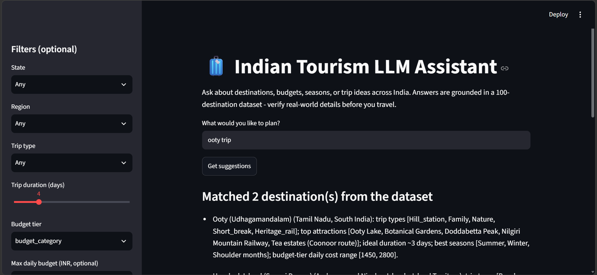
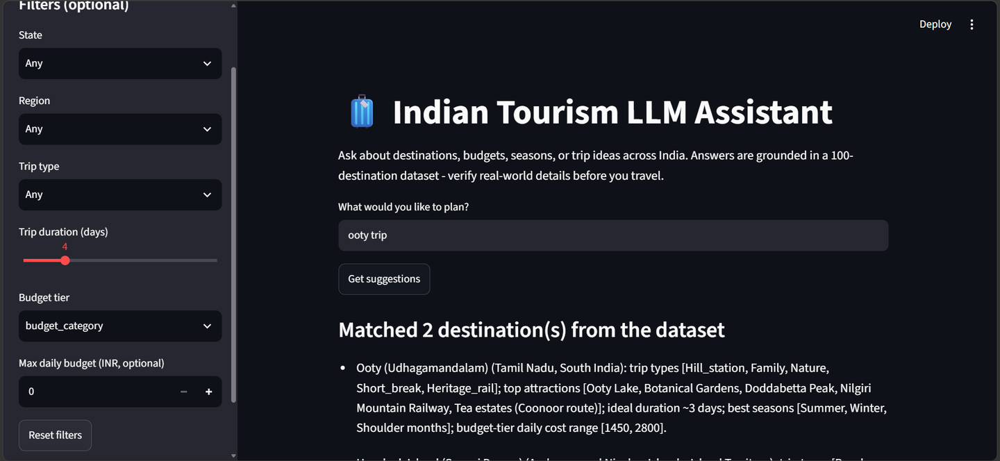

# 🧳 Indian Tourism LLM Assistant


A dataset-grounded travel-planning assistant for India. The application retrieves relevant destinations from a structured dataset of 100 Indian destinations and passes only those records to a large language model, so that answers about budgets, seasons and attractions are based on data rather than on the model's memory.

---

## Table of Contents

1. [Why This Project Exists](#why-this-project-exists)
2. [Solution Overview](#solution-overview)
3. [Screenshots](#screenshots)
4. [Key Features](#key-features)
5. [How It Works](#how-it-works)
6. [Design Decisions](#design-decisions)
7. [Dataset](#dataset)
8. [Technology Stack](#technology-stack)
9. [Getting Started](#getting-started)
10. [Configuration](#configuration)
11. [Usage](#usage)
12. [Project Structure](#project-structure)
13. [Limitations and Roadmap](#limitations-and-roadmap)
14. [Disclaimer](#disclaimer)
15. [Author](#author)

---

## Why This Project Exists

Large language models write fluent travel advice, but they are unreliable on exactly the details a traveller depends on: daily costs, best months to visit, ideal trip length and nearby transport. A confident but incorrect price or season can lead to a poorly planned trip.

This project addresses that weakness with **retrieval-grounded generation**: the model is given verified records and is instructed to answer only from them. This is the same pattern used in production LLM applications, implemented here in a compact and readable form.

## Solution Overview



## Screenshots

**Application interface** - free-text question, optional filters, and the destinations matched from the dataset:



**Filters and matched records** - the retrieved records are shown to the user before the assistant's answer, so the source of every fact is visible:



## Key Features

- **Grounded answers** - the model receives only records retrieved from the dataset and is instructed not to invent prices, distances, timings or attractions.
- **Transparent retrieval** - matched destinations are displayed in the interface before the generated answer.
- **Combinable filters** - state, region, trip type, trip duration (1-15 days), budget tier and maximum daily budget (INR).
- **Free-text search** - a question such as "ooty trip" is reduced to meaningful keywords (stop-words removed) and matched against destination names, attractions, activities and trip types.
- **Defensive error handling** - dedicated exceptions for dataset problems (`DatasetError`) and API problems (`LLMError`) produce clear messages in the interface.
- **Secure configuration** - the API key is read from a local `.env` file and is never hard-coded or committed.
- **Command-line smoke test** - `test_cli.py` verifies the dataset, search and API connection before the web interface is launched.

## How It Works

1. **Load** - `data_loader.py` reads the JSON file (read-only), validates that it exists, is valid JSON, is non-empty and is a list, and trims stray whitespace in text fields.
2. **Retrieve** - `search.py` applies the keyword match and every selected filter, and returns only records that exist in the dataset.
3. **Condense** - up to five matching records are converted into short summaries (name, state, region, trip types, attractions, ideal duration, best seasons, daily cost range).
4. **Generate** - `llm_client.py` sends the question and the summaries to the Groq API with a system prompt that enforces the grounding rules (temperature 0.4).
5. **Display** - `app.py` renders the matched records followed by the assistant's answer.

## Design Decisions

| Decision | Alternative | Reason for this choice |
|---|---|---|
| Retrieval-grounded prompting | Ask the LLM directly | Prevents invented prices, seasons and distances; answers can be traced to records |
| Keyword and filter retrieval | Embeddings and a vector database | Deterministic, easy to debug, and sufficient for 100 structured records; semantic search is listed on the roadmap |
| Official `groq` SDK | An orchestration framework | Fewer dependencies and a transparent request flow |
| Separate `data_loader`, `search` and `llm_client` modules | A single script | Each concern can be tested and changed independently |
| System prompt with explicit rules | Relying on model behaviour | Requires the model to state when data is missing and to ask clarifying questions |
| Dataset treated as read-only | In-place cleaning | The source data stays unchanged and reproducible |

## Dataset

`data/india_tourism_dataset.json` contains **100 records** covering **30 states and union territories**. Each record has **54 fields**, grouped as follows:

| Group | Example fields |
|---|---|
| Location and access | `state`, `district`, `region`, `coordinates`, `nearest_airport`, `nearest_railway_station`, `road_connectivity` |
| Budget tiers | `budget_category`, `mid_range_category`, `luxury_category` (accommodation, food, activities, transport and total daily range in INR) |
| Trip planning | `trip_types`, `primary_attractions`, `activities_available`, `minimum_days`, `ideal_days`, `maximum_days`, `suggested_itinerary` |
| Seasonality | `best_seasons`, `avoid_seasons`, `peak_tourist_season`, `average_temperature`, `rainfall_pattern` |
| Practical information | `safety_rating`, `permits_required`, `atm_availability`, `mobile_network`, `language_spoken` |
| Culture and food | `local_culture`, `festivals_events`, `local_cuisine_must_try`, `shopping_highlights` |

The application does not modify the dataset.

## Technology Stack

| Layer | Technology |
|---|---|
| Language | Python |
| Language model access | Groq API through the official `groq` SDK (default model: `openai/gpt-oss-120b`) |
| Web interface | Streamlit |
| Configuration | python-dotenv |
| Data handling | JSON, pandas |

## Getting Started

### Prerequisites

- Python 3.10 or later
- A Groq API key (available from the [Groq Console](https://console.groq.com/))
- Git

### Installation

```bash
# 1. Clone the repository
git clone https://github.com/<your-username>/<repository-name>.git
cd <repository-name>

# 2. Create and activate a virtual environment
python -m venv .venv

# Windows
.venv\Scripts\activate
# macOS / Linux
source .venv/bin/activate

# 3. Install dependencies
pip install -r requirements.txt

# 4. Create the environment file
# Windows
copy .env.example .env
# macOS / Linux
cp .env.example .env
```

Open `.env` and replace `your_api_key_here` with your own Groq API key.

### Run

```bash
# Optional: verify dataset loading, search and the API connection
python test_cli.py

# Launch the web application
streamlit run app.py
```

The application opens at `http://localhost:8501`.

## Configuration

| Setting | Location | Description |
|---|---|---|
| `GROQ_API_KEY` | `.env` | Groq API key. The file is excluded from Git through `.gitignore`. |
| `MODEL_NAME` | `src/llm_client.py` | Groq model identifier. Model availability changes over time; update this value if a "model not found" error appears. |
| `DATA_PATH` | `app.py` | Location of the dataset file. |

## Usage

Example questions:

- "Suggest a 4-day budget beach trip for a couple"
- "Hill station for a family trip in summer"
- "Ooty trip"
- "Heritage destinations in North India under a moderate budget"

Optional filters in the sidebar narrow the dataset before the question is sent to the model. The matched destinations appear first, followed by the assistant's answer.

## Project Structure

```
.
├── data/
│   └── india_tourism_dataset.json   # 100 destination records (read-only)
├── screenshots/
│   ├── 01-app-overview.png
│   └── 02-filters-and-matches.png
├── src/
│   ├── __init__.py
│   ├── data_loader.py               # safe JSON loading and validation
│   ├── search.py                    # keyword and filter retrieval, record summaries
│   └── llm_client.py                # Groq client, system prompt, ask function
├── app.py                           # Streamlit application
├── test_cli.py                      # command-line smoke tests
├── requirements.txt
├── .env.example                     # template for the API key
├── .gitignore
└── README.md
```

## Limitations and Roadmap

**Current limitations**

- Retrieval is keyword-based, so a query that shares no words with a record (for example, a synonym or a misspelling) may return no match.
- The knowledge base is limited to 100 destinations and reflects the data as of its last update; it is not connected to live prices or availability.
- Only the top five matched records are sent to the model.
- Automated unit tests are not yet included; `test_cli.py` is an integration smoke test that requires a valid API key.

**Planned improvements**

- [ ] Semantic retrieval using sentence embeddings and a vector store (for example, ChromaDB)
- [ ] Conversation memory for follow-up questions
- [ ] Human-readable labels for the budget-tier selector
- [ ] Unit tests for `data_loader` and `search` using `pytest`
- [ ] Deployment on Streamlit Community Cloud with secrets management

## Disclaimer

This project is intended for demonstration and learning purposes. Prices, timings and availability change frequently; please verify all real-world details before travelling. Generated answers do not constitute professional travel advice.

## Author

**Yogeshwaran**

- GitHub: [github.com/your-username](https://github.com/your-username)
- LinkedIn: [linkedin.com/in/your-profile](https://www.linkedin.com/in/your-profile)
